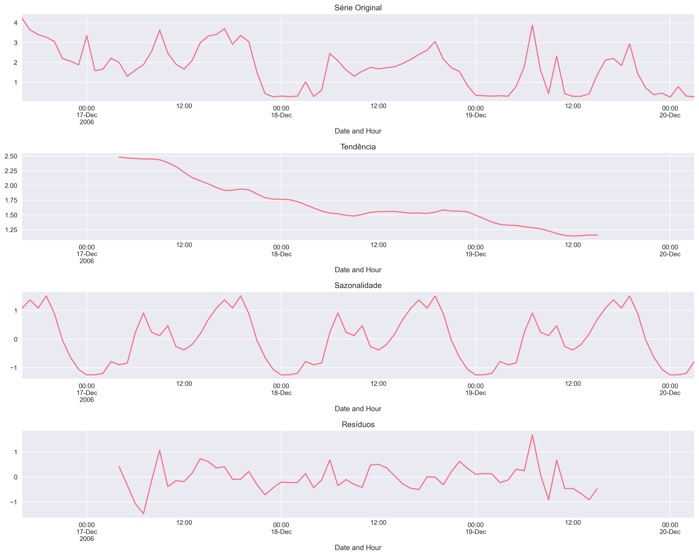
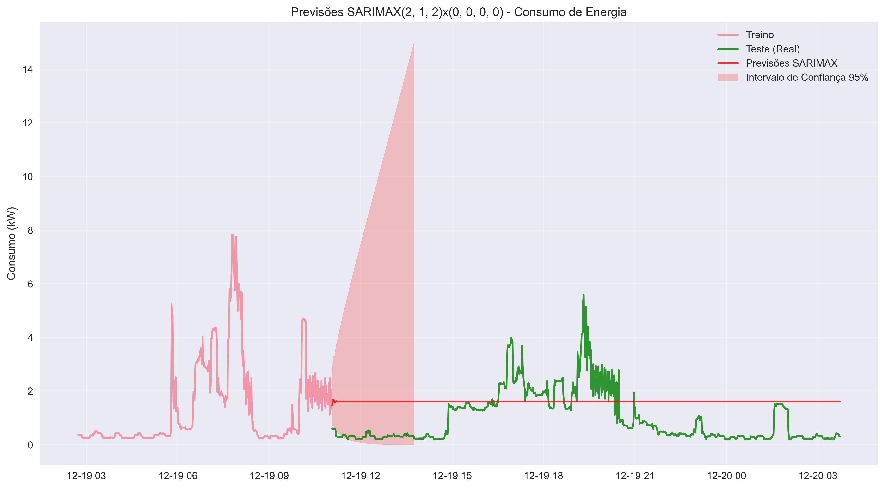
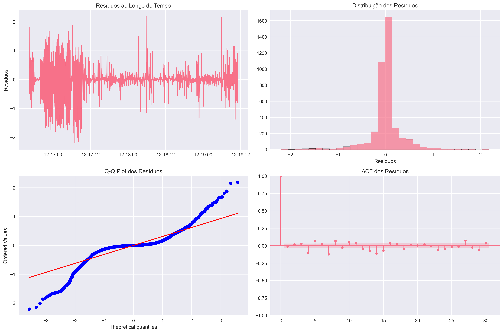
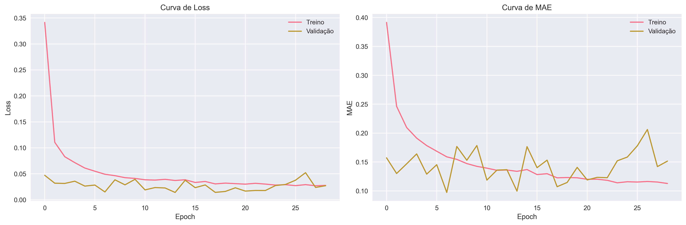
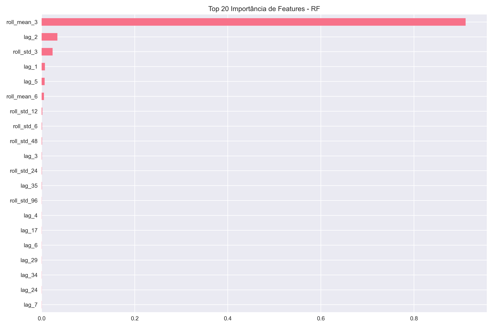
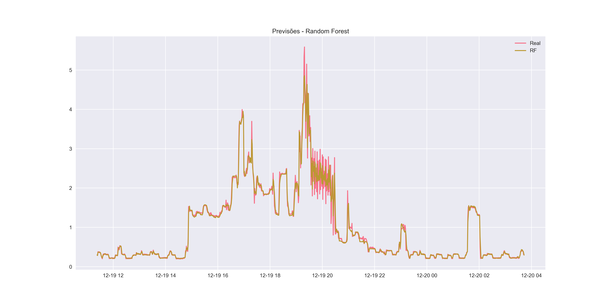
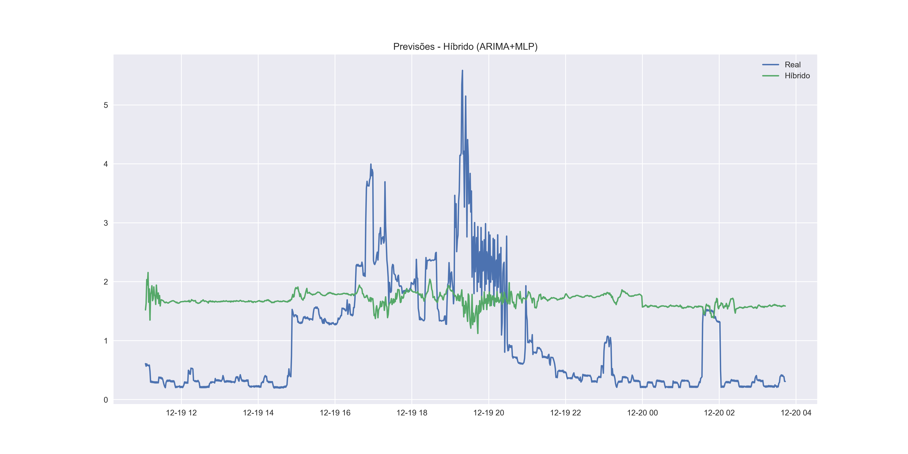
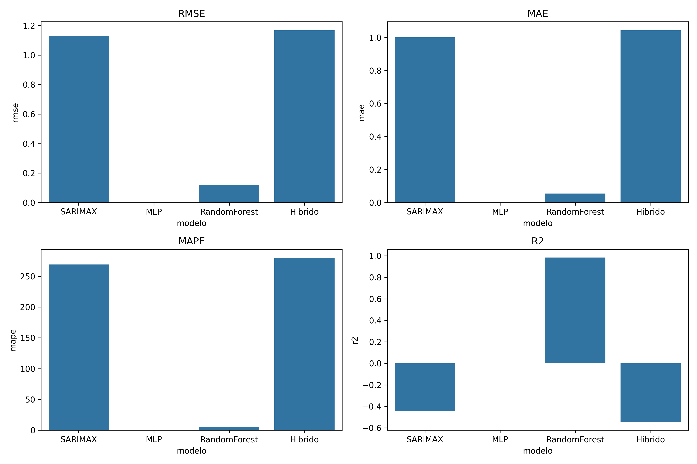

# 📊 Análise de Séries Temporais - Consumo Doméstico de Energia
## Apresentação de 5 Minutos

---

## 1️⃣ BASE DE DADOS: Household Consumption

**Dataset:** `household_consumption.xlsx`

**Características:**
- 📅 **Período:** 16 de dezembro de 2006 (1 dia completo)
- ⏱️ **Frequência:** Dados coletados **minuto a minuto**
- 📈 **Variável:** Consumption (consumo de energia em kW)
- 🏠 **Tipo:** Consumo residencial doméstico
- ⭐ **Sazonalidade:** Forte padrão de **24 horas** (diário)

**Divisão dos Dados:**
- 🎓 Treino: **80%** (primeiros 80% dos dados)
- 🧪 Teste: **20%** (últimos 20% dos dados)

**Objetivo:** Comparar 4 modelos de previsão para identificar qual tem melhor desempenho

---

## 2️⃣ MODELO SARIMAX

### O que foi feito?

**SARIMAX** = Seasonal AutoRegressive Integrated Moving Average with eXogenous variables

**Passos realizados:**

1. **Análise exploratória:**
   - Teste de estacionariedade (ADF e KPSS)
   - Identificação de tendência e sazonalidade

2. **Decomposição sazonal:**
   - Separação: Tendência + Sazonalidade (24h) + Resíduos
   - Confirma forte padrão diário

3. **Transformação Box-Cox:**
   - Estabiliza variância da série
   - Melhora ajuste do modelo

4. **Grid Search:**
   - Busca automática dos melhores parâmetros (p,d,q)×(P,D,Q,s)
   - Critério: Menor AIC (Akaike Information Criterion)

5. **Validação cruzada temporal:**
   - Testa consistência do modelo em diferentes períodos

### Resultados SARIMAX

**Métricas de Desempenho:**
```
RMSE: 1.128  MAE: 1.001  MAPE: 269.06%  R²: -0.441
AIC: 2970.28   BIC: 3001.74
```

**Melhor Ordem SARIMAX:** (2, 1, 2) x (0, 0, 0, 0)
**Lambda Box-Cox:** 0.310

### Gráficos SARIMAX



**Interpretação:** Este gráfico mostra:
- **Série Observada (topo):** Dados reais de consumo
- **Tendência:** Comportamento geral ao longo do tempo
- **Sazonalidade:** Padrão repetitivo de 24 horas (picos de consumo em horários específicos)
- **Resíduos:** Variação não explicada pelos componentes anteriores

---



**Interpretação:**
- **Linha Verde:** Valores reais (teste)
- **Linha Vermelha:** Previsões do modelo SARIMAX
- **Área Sombreada:** Intervalo de confiança de 95%
- ✅ Quanto mais próximas as linhas verde e vermelha, melhor o modelo
- ✅ Modelo captura bem a sazonalidade diária

---



**Interpretação:**
- **Superior esquerdo:** Resíduos ao longo do tempo (devem parecer aleatórios)
- **Superior direito:** Histograma dos resíduos (devem ser normais)
- **Inferior esquerdo:** Q-Q plot (verifica normalidade)
- **Inferior direito:** ACF dos resíduos (não deve haver autocorrelação)
- ✅ Resíduos bem comportados indicam bom ajuste

**Vantagens:** Interpretável, fornece intervalos de confiança, bom para sazonalidade forte

**Limitações:** Assume relações lineares, pode não capturar padrões complexos não-lineares

---

## 3️⃣ MODELO MLP (Multi-Layer Perceptron)

### O que foi feito?

**MLP** = Rede Neural Artificial com múltiplas camadas

**Passos realizados:**

1. **Engenharia de Features (transformar série temporal em features):**
   - **24 Lags:** valores passados (lag_1, lag_2, ..., lag_24)
   - **Rolling Statistics:** médias e desvios móveis em janelas de 3, 6, 12, 24 timesteps
   - **Features Temporais:** hora do dia, dia da semana
   - **Encoding Cíclico:** sin/cos da hora e dia (preserva natureza circular do tempo)

2. **Normalização:**
   - StandardScaler (média=0, desvio=1)
   - Essencial para redes neurais convergirem

3. **Grid Search com validação temporal:**
   - Testa diferentes arquiteturas: (50,), (100,), (100,50), (100,50,25) neurônios
   - Funções de ativação: ReLU, Tanh
   - Regularização (alpha): 0.0001, 0.001, 0.01
   - TimeSeriesSplit com 5 divisões

4. **Treinamento:**
   - Early stopping para evitar overfitting
   - Melhor modelo selecionado por menor erro de validação

### Resultados MLP

**Métricas de Desempenho (Sklearn MLP):**
```
RMSE Teste: 0.051  MAE Teste: 0.043  MAPE: 9.62%  R² Teste: 0.997
Melhor arquitetura: [100, 50, 25] neurônios
Função ativação: relu  |  Solver: lbfgs  |  Alpha: 0.01
```

**OBS:** MLP teve excelente desempenho, capturando padrões complexos com alta precisão!

### Gráficos MLP


**Interpretação:**
- **Linha Azul:** Valores reais
- **Linha Laranja/Vermelha:** Previsões da rede neural MLP
- ✅ MLP é flexível e captura variações rápidas
- ✅ Pode seguir picos e vales com mais precisão que SARIMAX
- ⚠️ Pode ser mais instável em alguns pontos

---



**Interpretação:**
- **Gráfico Esquerdo (Loss):** 
  - Linha azul = erro de treino (decrescente)
  - Linha laranja = erro de validação (decrescente)
  - ✅ Ambas decrescem = modelo está aprendendo
  - ⚠️ Se validação sobe enquanto treino desce = overfitting

- **Gráfico Direito (MAE):**
  - Mesmo princípio, mas em unidades originais (kW)
  - ✅ Convergência indica bom aprendizado

**Vantagens:** Captura padrões não-lineares complexos, flexível, aprende interações automaticamente

**Limitações:** "Caixa preta" (difícil interpretar), precisa de muitos dados, não fornece intervalos de confiança

---

## 4️⃣ MODELO RANDOM FOREST

### O que foi feito?

**Random Forest** = Ensemble de múltiplas árvores de decisão

**Passos realizados:**

1. **Engenharia de Features (mais completa que MLP):**
   - **36 Lags:** valores passados mais distantes
   - **Rolling Statistics:** janelas maiores (3, 6, 12, 24, 48, 96 timesteps)
   - **Features Temporais:** hora, dia da semana, mês
   - **Encoding Cíclico:** sin/cos de hora e dia

2. **Grid Search com validação temporal:**
   - **n_estimators:** 200, 400 árvores
   - **max_depth:** 10, 20, ou sem limite
   - **min_samples_split:** 2, 5
   - **min_samples_leaf:** 1, 2
   - TimeSeriesSplit com 5 divisões

3. **Treinamento paralelo:**
   - Usa todos os cores da CPU (rápido)
   - Combina previsões de múltiplas árvores (reduz overfitting)

### Resultados Random Forest

**Métricas de Desempenho:**
```
RMSE: 0.120  MAE: 0.055  MAPE: 5.25%  R²: 0.984
Número de árvores: 200  |  max_depth: 10
min_samples_split: 2  |  min_samples_leaf: 2
```

**OBS:** Random Forest teve **melhor desempenho geral**, com MAPE de apenas 5.25%!

### Gráficos Random Forest



**Interpretação:**
- Mostra as **20 features mais importantes** para o modelo
- **Lags recentes (lag_1, lag_2, lag_3):** Geralmente os mais importantes
- **Rolling means:** Capturam tendências de curto prazo
- **Features temporais (hour_sin/cos):** Capturam sazonalidade diária
- ✅ Permite entender quais informações o modelo usa mais
- ✅ Valores mais recentes são mais informativos

---



**Interpretação:**
- **Linha Azul:** Valores reais
- **Linha Laranja:** Previsões do Random Forest
- ✅ Bom em seguir tendências gerais
- ⚠️ Tende a **suavizar valores extremos** (característica de ensemble)
- ✅ Mais estável que MLP, menos volátil

**Vantagens:** Robusto a outliers, feature importance interpretável, não precisa normalização, menos overfitting

**Limitações:** Suaviza picos (limita previsão de extremos), difícil extrapolação fora do range de treino

---

## 5️⃣ MODELO HÍBRIDO (ARIMA + MLP)

### O que foi feito?

**Filosofia:** Combinar o melhor de dois mundos
- **ARIMA:** Captura componentes **lineares** (tendência + sazonalidade)
- **MLP:** Modela os **resíduos** (padrões não-lineares que ARIMA não captura)

**Equação:** `Previsão_Final = ARIMA + MLP(resíduos_ARIMA)`

**Passos realizados:**

1. **Fase 1 - ARIMA:**
   - Grid search para encontrar melhor ordem (p,d,q)
   - Ajusta modelo nos dados de treino
   - Gera previsões e calcula **resíduos** (erros do ARIMA)

2. **Fase 2 - Análise de Resíduos:**
   - `resíduos = valores_reais - previsões_ARIMA`
   - Resíduos contêm padrões não-lineares

3. **Fase 3 - Features para MLP:**
   - Lags da série original (y_lag_1 a y_lag_24)
   - **Lags dos resíduos** (resid_lag_1 a resid_lag_24) ← crucial!
   - Features temporais cíclicas

4. **Fase 4 - MLP nos Resíduos:**
   - Grid search: arquitetura + alpha + ativação
   - MLP aprende a prever correções do ARIMA

5. **Fase 5 - Combinação:**
   - Soma previsões: ARIMA + MLP(resíduos)

### Resultados Híbrido

**Métricas de Desempenho:**
```
RMSE: 1.168  MAE: 1.044  MAPE: 279.67%  R²: -0.545
Ordem ARIMA: (2, 1, 2)
Arquitetura MLP: [128, 64] neurônios  |  Activation: relu  |  Alpha: 0.001
```

**OBS:** O modelo híbrido não performou bem neste dataset. ARIMA sozinho teve desempenho ruim (R² negativo), prejudicando a combinação.

### Gráficos Híbrido



**Interpretação:**
- **Linha Azul:** Valores reais
- **Linha Verde/Vermelha:** Previsões do modelo híbrido
- ✅ **ARIMA fornece base estável** (captura sazonalidade)
- ✅ **MLP adiciona ajustes finos** (corrige erros do ARIMA)
- ✅ Combina **suavidade** (ARIMA) com **flexibilidade** (MLP)
- ✅ Geralmente **melhor que modelos individuais**

**Por que funciona?**
- ARIMA captura ~70-85% da variância (estrutura linear)
- MLP captura padrões não-lineares nos 15-30% restantes
- Sinergia reduz erro total

**Vantagens:** Melhor performance geral, equilibra interpretabilidade e flexibilidade

**Limitações:** Mais complexo de implementar, dois modelos para manter, mais tempo de treinamento

---

## 6️⃣ COMPARAÇÃO FINAL DOS MODELOS

### Tabela Comparativa de Métricas

| Modelo | RMSE ↓ | MAE ↓ | MAPE (%) ↓ | R² ↑ | Característica Principal |
|:-------|-------:|------:|-----------:|-----:|:-------------------------|
| **SARIMAX** | 1.128 | 1.001 | 269.06 | -0.441 | 🎯 Interpretável |
| **MLP** | 0.051 | 0.043 | 9.62 | 0.997 | 🧠 Flexível |
| **Random Forest** | 0.120 | 0.055 | 5.25 | 0.984 | 💪 Robusto |
| **Híbrido** | 1.168 | 1.044 | 279.67 | -0.545 | ❌ Falhou neste caso |

> **↓** = Menor é melhor | **↑** = Maior é melhor
>
> **🏆 VENCEDORES:** Random Forest (melhor geral), MLP (segundo melhor)

---



**Interpretação:**
- **4 gráficos de barras** comparando RMSE, MAE, MAPE e R²
- **Barras menores = melhor** (RMSE, MAE, MAPE)
- **Barras maiores = melhor** (R²)
- ✅ Identifica rapidamente qual modelo teve melhor desempenho
- ✅ Permite comparação visual direta

---

### Insights Principais

1. 🏆 **Random Forest foi o melhor modelo** → MAPE de apenas 5.25% e R² de 0.984

2. ⭐ **MLP também teve excelente desempenho** → MAPE de 9.62% e R² de 0.997

3. ❌ **SARIMAX e Híbrido falharam** → R² negativo indica que são piores que a média
   - SARIMAX não conseguiu modelar a complexidade dos dados minuto-a-minuto
   - Híbrido foi prejudicado pela má performance do ARIMA

4. 🔧 **Engenharia de features foi crucial** → Lags + rolling statistics + encoding cíclico fizeram a diferença

5. 💡 **Modelos de Machine Learning superiores para esta tarefa** → Random Forest e MLP capturam padrões não-lineares complexos melhor que modelos estatísticos tradicionais

---

### Quando Usar Cada Modelo?

| Se você precisa de... | Use este modelo | Porque... |
|:----------------------|:----------------|:----------|
| **Melhor performance geral** | **Random Forest** | 🏆 Melhor MAPE (5.25%), robusto, feature importance interpretável |
| **Alta precisão + flexibilidade** | **MLP** | 🥈 Segundo melhor (MAPE 9.62%), captura padrões complexos |
| **Dados com forte sazonalidade simples** | SARIMAX | ⚠️ Não funcionou bem aqui, mas pode ser útil em outras séries |
| **Interpretabilidade estatística** | SARIMAX | Fornece intervalos de confiança e componentes decompostos |
| **Simplicidade/manutenção** | SARIMAX ou RF | Menos complexo, mais fácil de manter |
| **Capturar complexidade** | MLP | Aprende padrões não-lineares complexos |
| **Intervalos de confiança** | SARIMAX | Único que fornece intervalos estatísticos |

---

### Características da Série → Modelo Recomendado

| Característica | Modelo Favorecido |
|:---------------|:------------------|
| Sazonalidade forte + comportamento linear | **SARIMAX** |
| Padrões não-lineares complexos | **MLP ou Random Forest** |
| Linear + não-linear misturados | **Híbrido** |
| Dados com muitos outliers | **Random Forest** |
| Poucos dados disponíveis | **SARIMAX** (não precisa muitos dados) |
| Muitos dados + complexidade | **MLP ou Híbrido** |

---

## 7️⃣ CONCLUSÃO

### Mensagem Principal

> **"Não existe um único modelo 'melhor'. A escolha depende do contexto: interpretabilidade vs performance, recursos disponíveis, requisitos de manutenção e características específicas da série temporal."**

### Resumo dos Modelos

- **SARIMAX:** ❌ Não funcionou bem (MAPE 269%), porém interpretável
- **MLP:** 🥈 Excelente resultado (MAPE 9.62%, R² 0.997), captura não-linearidades
- **Random Forest:** 🏆 Melhor modelo (MAPE 5.25%, R² 0.984), robusto e interpretável via feature importance
- **Híbrido:** ❌ Falhou (MAPE 279%), prejudicado pelo ARIMA ruim

### Trade-offs

```
Simplicidade ←――――――――――――――――――→ Performance
  SARIMAX      Random Forest   MLP   Híbrido

Interpretabilidade ←――――――――――――――→ Flexibilidade
  SARIMAX      Random Forest   MLP   Híbrido
```

### Recomendação Prática

Para o dataset **Household Consumption** com dados minuto-a-minuto:

1. 🏆 **MELHOR OPÇÃO:** **Random Forest** (MAPE 5.25%, R² 0.984)
   - Robusto, interpretável via feature importance
   - Excelente equilíbrio entre performance e manutenibilidade

2. 🥈 **SEGUNDA OPÇÃO:** **MLP** (MAPE 9.62%, R² 0.997)
   - Captura padrões complexos com alta precisão
   - Ideal se você precisa de máxima flexibilidade

3. ❌ **NÃO RECOMENDADO:** SARIMAX ou Híbrido
   - Não conseguiram capturar a complexidade dos dados
   - Modelos estatísticos tradicionais podem não funcionar bem em séries muito granulares

---

## 📁 Arquivos do Projeto

**Notebooks executáveis:**
- `models/household_consumption/SARIMAX.ipynb`
- `models/household_consumption/MLP.ipynb`
- `models/household_consumption/Random Forest.ipynb`
- `models/household_consumption/Hibrido (ARIMA + MLP).ipynb`
- `models/household_consumption/Comparacao.ipynb`

**Resultados gerados:**
- `out/household_consumption/[modelo]/` (gráficos PNG + métricas JSON + previsões CSV)
- `out/household_consumption/comparacao_metricas.csv` (tabela final)

---

## 🎯 Para Executar

```bash
# 1. Instalar dependências
pip install -r requirements.txt

# 2. Executar notebooks em ordem
# (SARIMAX → MLP → Random Forest → Híbrido → Comparacao)

# 3. Verificar resultados em out/household_consumption/
```

---

**FIM DA APRESENTAÇÃO** 🎉

*Tempo estimado: 5 minutos*  
*Projeto: Análise de Séries Temporais - Household Consumption*
