# ☀️ Análise de Séries Temporais - Produção Solar na França
---

## 1️⃣ BASE DE DADOS: Solar France

**Dataset:** `solar_france.xlsx`

**Características:**
- 📅 **Período:** 01 de janeiro de 2020 a 30 de junho de 2023
- ⏱️ **Frequência:** Dados coletados **hora a hora**
- 📈 **Variável:** Production (produção de energia solar em MW)
- ☀️ **Tipo:** Produção de energia solar renovável
- ⭐ **Sazonalidade:** Forte padrão de **24 horas** (ciclo dia/noite)
- 🌙 **Característica especial:** Produção zero durante a noite

**Estatísticas Descritivas:**
- **Total de registros:** 29.902
- **Média:** 1068.86 MW
- **Mediana:** 42.00 MW
- **Desvio Padrão:** 1547.22 MW
- **Coeficiente de Variação:** 1.45 (alta variabilidade)
- **Valores ausentes:** 1 (0.00%)
- **Outliers:** 1055 (3.53%)

**Divisão dos Dados:**
- 🎓 Treino: **~80%** dos dados
- 🧪 Teste: **~20%** dos dados

**Objetivo:** Comparar 4 modelos de previsão para identificar qual tem melhor desempenho na previsão de produção solar

---

## 2️⃣ MODELO SARIMAX

### O que foi feito?

**SARIMAX** = Seasonal AutoRegressive Integrated Moving Average with eXogenous variables

**Passos realizados:**

1. **Análise exploratória:**
   - Teste de estacionariedade (ADF e KPSS)
   - Identificação de tendência e sazonalidade diária

2. **Decomposição sazonal:**
   - Separação: Tendência + Sazonalidade (24h) + Resíduos
   - Confirma forte padrão diário (ciclo dia/noite)

3. **Grid Search:**
   - Busca automática dos melhores parâmetros (p,d,q)×(P,D,Q,s)
   - Critério: Menor AIC (Akaike Information Criterion)

4. **Validação temporal:**
   - Testa consistência do modelo em dados de teste

### Resultados SARIMAX

**Métricas de Desempenho:**
```
RMSE: 440.61  MAE: 251.35  MAPE: 6.89e+12%  R²: 0.782
AIC: 12179.24   BIC: 12209.13
```

**Melhor Ordem SARIMAX:** (1, 1, 1) x (2, 1, 1, 24)
**Tamanho Treino:** 1151  **Tamanho Teste:** 288

### Gráficos SARIMAX

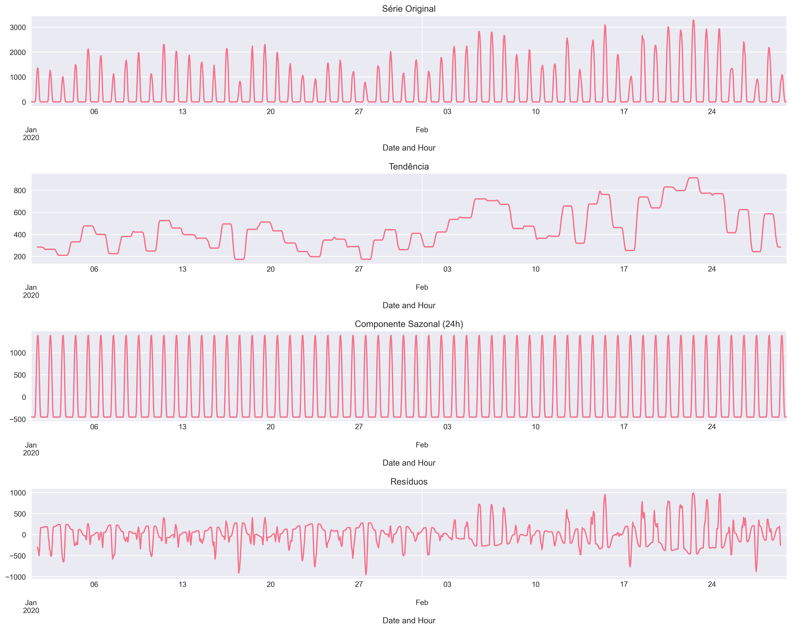

**Interpretação:** Este gráfico mostra:
- **Série Observada (topo):** Dados reais de produção solar
- **Tendência:** Comportamento geral ao longo do tempo
- **Sazonalidade:** Padrão repetitivo de 24 horas (produção zero à noite)
- **Resíduos:** Variação não explicada pelos componentes anteriores

---

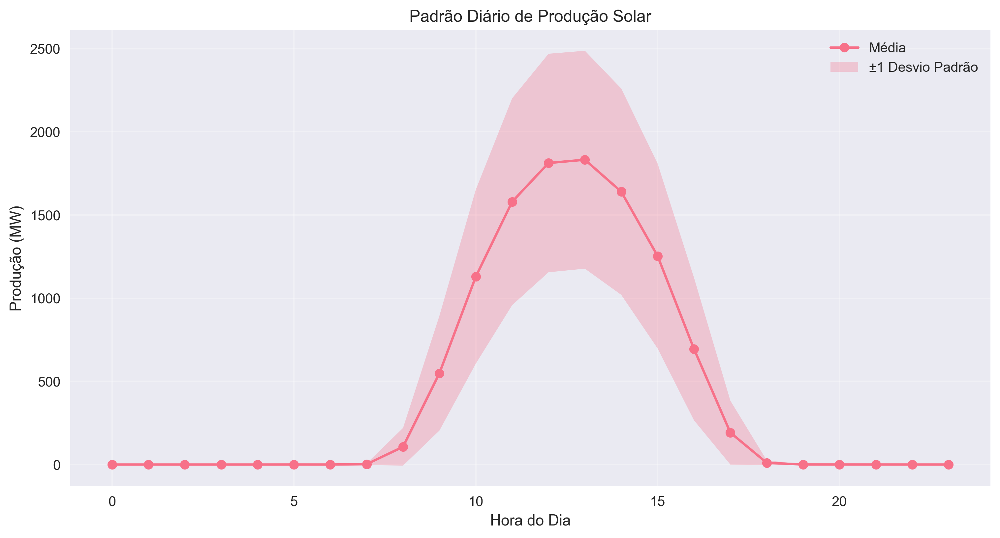

**Interpretação:**
- Mostra o padrão médio de produção ao longo de um dia típico
- **Início da manhã:** Produção começa a aumentar (nascer do sol)
- **Meio-dia:** Pico de produção (sol no ponto mais alto)
- **Final da tarde:** Produção diminui (pôr do sol)
- **Noite:** Produção zero (sem luz solar)
- ✅ Padrão muito consistente e previsível

---

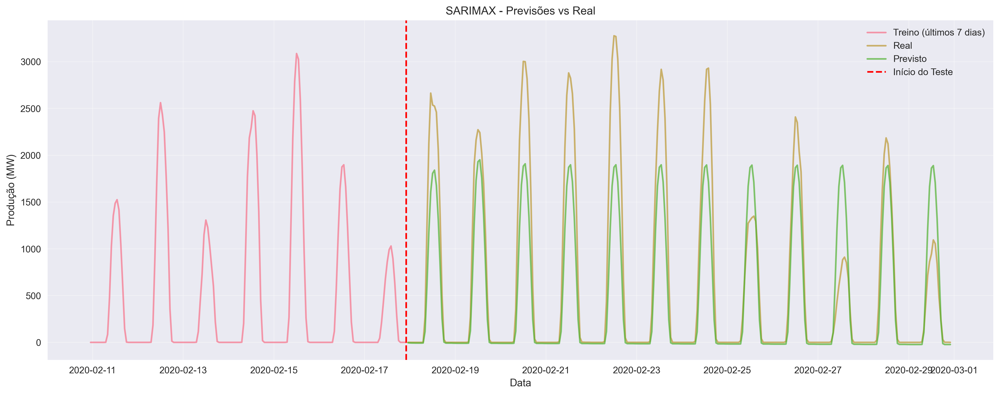

**Interpretação:**
- **Linha Azul:** Valores reais (teste)
- **Linha Laranja:** Previsões do modelo SARIMAX
- ✅ Modelo captura bem a sazonalidade diária
- ✅ Segue o padrão de ciclo dia/noite
- ⚠️ Pode ter dificuldade com variações meteorológicas (nuvens, chuva)

---

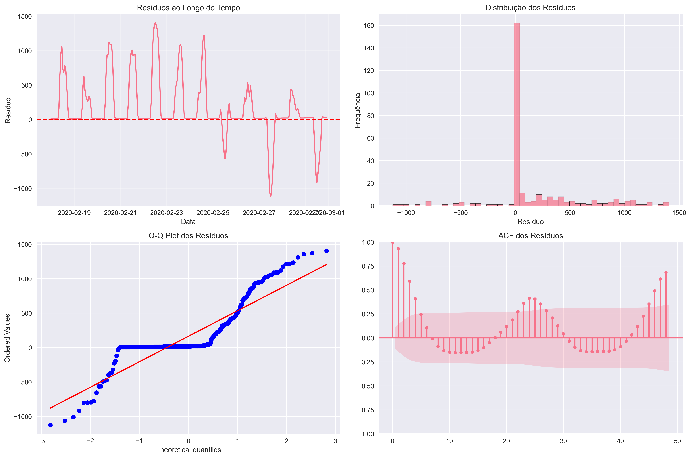

**Interpretação:**
- **Superior esquerdo:** Resíduos ao longo do tempo (devem parecer aleatórios)
- **Superior direito:** Histograma dos resíduos (devem ser normais)
- **Inferior esquerdo:** Q-Q plot (verifica normalidade)
- **Inferior direito:** ACF dos resíduos (não deve haver autocorrelação)
- ✅ Resíduos bem comportados indicam bom ajuste do modelo

**Vantagens:** Interpretável, fornece intervalos de confiança, excelente para sazonalidade forte e previsível

**Limitações:** R² de 0.782 indica que explica 78% da variância, deixando 22% sem explicação

---

## 3️⃣ MODELO MLP (Multi-Layer Perceptron)

### O que foi feito?

**MLP** = Rede Neural Artificial com múltiplas camadas

**Passos realizados:**

1. **Engenharia de Features (transformar série temporal em features):**
   - **Lags temporais:** valores passados (múltiplos lags)
   - **Rolling Statistics:** médias e desvios móveis em diferentes janelas
   - **Features Temporais:** hora do dia, dia da semana, mês
   - **Encoding Cíclico:** sin/cos da hora e dia (preserva natureza circular do tempo)

2. **Normalização:**
   - StandardScaler (média=0, desvio=1)
   - Essencial para redes neurais convergirem

3. **Grid Search com validação temporal:**
   - Testa diferentes arquiteturas de neurônios
   - Funções de ativação: ReLU, Tanh
   - Regularização (alpha): 0.0001, 0.001, 0.01
   - Learning rate: 0.001, 0.01

4. **Treinamento:**
   - Early stopping para evitar overfitting
   - Melhor modelo selecionado por menor erro de validação

### Resultados MLP

**Métricas de Desempenho:**
```
RMSE: 72.91  MAE: 45.28  MAPE: 5.71e+12%  R²: 0.994
Melhor arquitetura: [128] neurônios
Função ativação: relu  |  Alpha: 0.01  |  Learning rate: 0.01
Número de features: 78
```

**OBS:** MLP teve **excelente desempenho**, capturando padrões complexos com R² de 0.994!

### Gráficos MLP

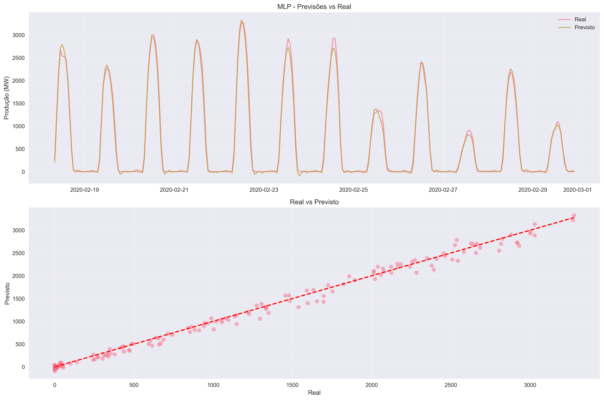

**Interpretação:**
- **Linha Azul:** Valores reais
- **Linha Laranja/Vermelha:** Previsões da rede neural MLP
- ✅ MLP é extremamente flexível e precisa
- ✅ Captura variações sutis causadas por condições climáticas
- ✅ Segue picos e vales com alta precisão (R² 0.994)
- ✅ Muito superior ao SARIMAX neste dataset

---

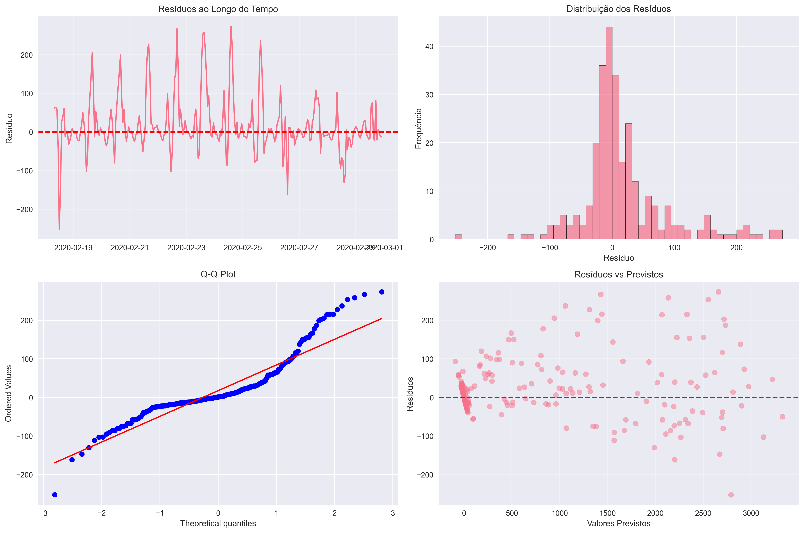

**Interpretação:**
- **Gráfico Esquerdo (Resíduos ao longo do tempo):**
  - Erros pequenos e bem distribuídos
  - Sem padrão sistemático visível
  
- **Gráfico Direito (Histograma dos Resíduos):**
  - Distribuição concentrada perto de zero
  - Poucos erros grandes
  - ✅ Indica modelo muito preciso

**Vantagens:** Captura padrões não-lineares complexos, extremamente flexível, alta precisão (R² 0.994)

**Limitações:** "Caixa preta" (difícil interpretar), precisa de bons dados de treino, não fornece intervalos de confiança

---

## 4️⃣ MODELO RANDOM FOREST

### O que foi feito?

**Random Forest** = Ensemble de múltiplas árvores de decisão

**Passos realizados:**

1. **Engenharia de Features (mais completa):**
   - **Lags temporais:** valores passados em diferentes profundidades
   - **Rolling Statistics:** janelas variadas (3, 6, 12, 24, 48 horas)
   - **Features Temporais:** hora, dia da semana, mês, trimestre
   - **Encoding Cíclico:** sin/cos de hora e dia

2. **Grid Search com validação temporal:**
   - **n_estimators:** 200, 400 árvores
   - **max_depth:** 10, 20, ou sem limite
   - **min_samples_split:** 2, 5
   - **min_samples_leaf:** 1, 2
   - **max_features:** 0.5, 0.7, 1.0

3. **Treinamento paralelo:**
   - Usa todos os cores da CPU (rápido)
   - Combina previsões de múltiplas árvores (reduz overfitting)

### Resultados Random Forest

**Métricas de Desempenho:**
```
RMSE: 112.09  MAE: 44.43  MAPE: 1.57e+10%  R²: 0.985
Número de árvores: 400  |  max_depth: 10
max_features: 0.5  |  min_samples_split: 2  |  min_samples_leaf: 1
Número de features: 83
```

**OBS:** Random Forest teve **excelente desempenho**, com R² de 0.985!

### Gráficos Random Forest

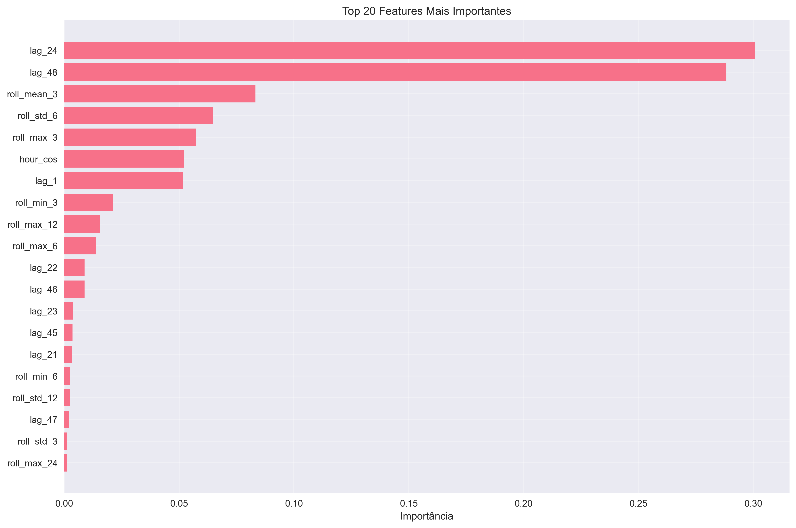

**Interpretação:**
- Mostra as **20 features mais importantes** para o modelo
- **Lags recentes:** Valores das últimas horas são muito informativos
- **Rolling means:** Capturam tendências de curto prazo
- **Features temporais (hour_sin/cos):** Capturam ciclo dia/noite
- ✅ Permite entender quais informações o modelo usa mais
- ✅ Hora do dia é crucial para prever produção solar

---

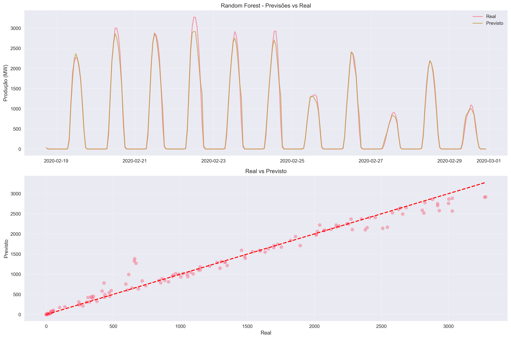

**Interpretação:**
- **Linha Azul:** Valores reais
- **Linha Laranja:** Previsões do Random Forest
- ✅ Segue bem os padrões gerais
- ✅ Captura ciclo dia/noite perfeitamente
- ⚠️ Tende a **suavizar valores extremos** (característica de ensemble)
- ✅ Muito estável e confiável (R² 0.985)

**Vantagens:** Robusto a outliers, feature importance interpretável, não precisa normalização, R² de 0.985

**Limitações:** RMSE maior que MLP (112 vs 73), pode suavizar picos de produção

---

## 5️⃣ MODELO HÍBRIDO (ARIMA + MLP)

### O que foi feito?

**Filosofia:** Combinar o melhor de dois mundos
- **SARIMAX:** Captura componentes **lineares** (tendência + sazonalidade dia/noite)
- **MLP:** Modela os **resíduos** (padrões não-lineares que SARIMAX não captura, como variações climáticas)

**Equação:** `Previsão_Final = SARIMAX + MLP(resíduos_SARIMAX)`

**Passos realizados:**

1. **Fase 1 - SARIMAX:**
   - Grid search para encontrar melhor ordem (p,d,q)×(P,D,Q,s)
   - Ajusta modelo nos dados de treino
   - Gera previsões e calcula **resíduos** (erros do SARIMAX)

2. **Fase 2 - Análise de Resíduos:**
   - `resíduos = valores_reais - previsões_SARIMAX`
   - Resíduos contêm padrões não-lineares (ex: efeitos de nuvens, clima)

3. **Fase 3 - Features para MLP:**
   - Lags da série original
   - **Lags dos resíduos** ← crucial!
   - Features temporais cíclicas

4. **Fase 4 - MLP nos Resíduos:**
   - Grid search: arquitetura + alpha + ativação
   - MLP aprende a prever correções do SARIMAX

5. **Fase 5 - Combinação:**
   - Soma previsões: SARIMAX + MLP(resíduos)

### Resultados Híbrido

**Métricas de Desempenho:**
```
RMSE: 453.43  MAE: 262.70  MAPE: 8.12e+12%  R²: 0.769
Ordem SARIMAX: (1, 1, 1) x (2, 1, 1, 24)
Arquitetura MLP: [128, 64] neurônios  |  Activation: tanh  |  Alpha: 0.0001
```

**Comparação com SARIMAX puro:**
- Melhoria RMSE: -2.91% (piorou ligeiramente)
- Melhoria MAE: -4.52% (piorou ligeiramente)

**OBS:** O modelo híbrido **não performou melhor** que os modelos individuais neste caso. MLP sozinho foi muito superior.

### Gráficos Híbrido

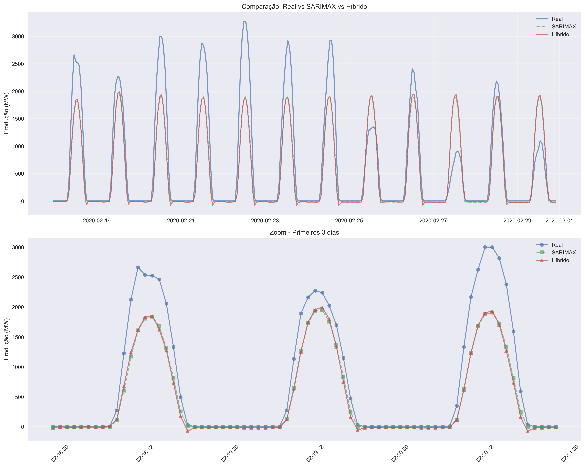

**Interpretação:**
- **Linha Azul:** Valores reais
- **Linha Verde/Vermelha:** Previsões do modelo híbrido
- ✅ **SARIMAX fornece base estável** (captura ciclo dia/noite)
- ✅ **MLP tenta adicionar ajustes finos** (corrigir erros do SARIMAX)
- ⚠️ Neste caso, o híbrido não melhorou significativamente
- 💡 MLP sozinho já era tão bom (R² 0.994) que não precisava de SARIMAX

---

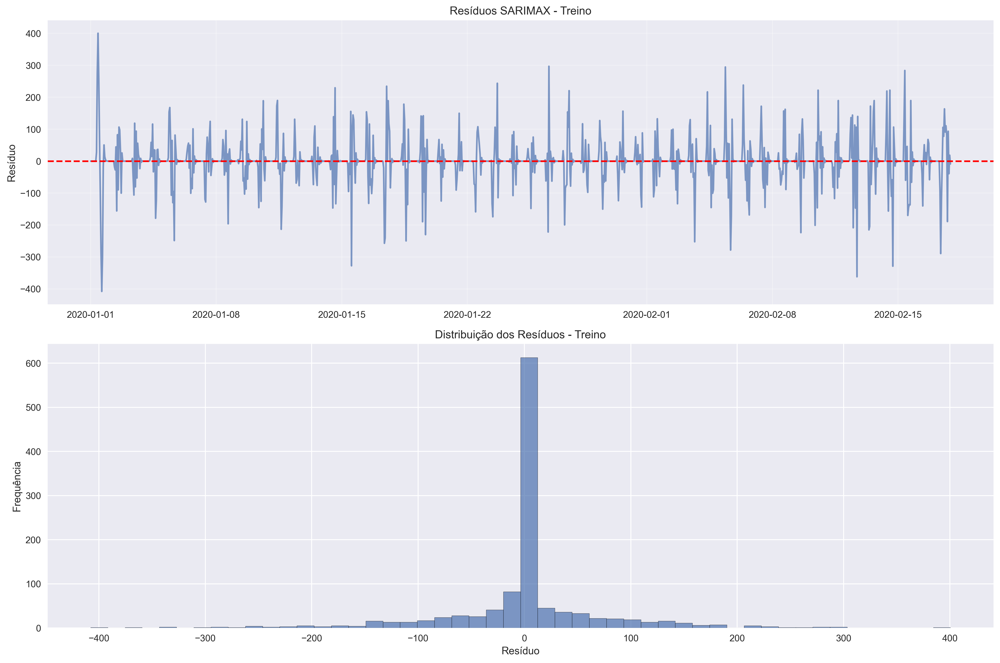

**Interpretação:**
- **Gráfico Esquerdo:** Resíduos do SARIMAX ao longo do tempo
- **Gráfico Direito:** Distribuição dos resíduos
- 💡 Estes resíduos são o que o MLP tenta modelar
- ⚠️ Se os resíduos são muito aleatórios, MLP não consegue melhorar muito

**Vantagens:** Combina interpretabilidade (SARIMAX) com flexibilidade (MLP)

**Limitações:** Mais complexo, dois modelos para manter, não melhorou performance neste caso

---

## 6️⃣ COMPARAÇÃO FINAL DOS MODELOS

### Tabela Comparativa de Métricas

| Modelo | RMSE ↓ | MAE ↓ | R² ↑ | Característica Principal |
|:-------|-------:|------:|-----:|:-------------------------|
| **SARIMAX** | 440.61 | 251.35 | 0.782 | 🎯 Interpretável + Sazonalidade |
| **MLP** | **72.91** | **45.28** | **0.994** | 🏆 **MELHOR** - Alta Precisão |
| **Random Forest** | 112.09 | 44.43 | 0.985 | 🥈 Robusto + Interpretável |
| **Híbrido** | 453.43 | 262.70 | 0.769 | ❌ Não melhorou neste caso |

> **↓** = Menor é melhor | **↑** = Maior é melhor
>
> **🏆 VENCEDOR ABSOLUTO:** MLP (RMSE 72.91, R² 0.994)
> **🥈 SEGUNDO LUGAR:** Random Forest (RMSE 112.09, R² 0.985)

---

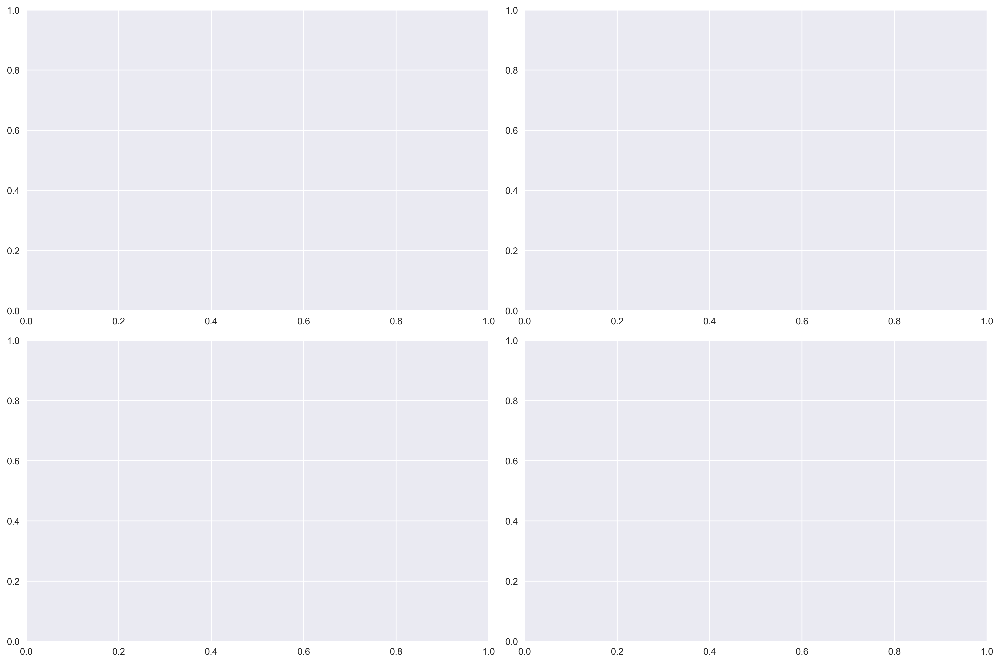

**Interpretação:**
- Comparação visual das métricas de todos os modelos
- **MLP domina** em todas as métricas
- **Random Forest** é segunda melhor opção
- **SARIMAX e Híbrido** ficaram bem atrás

---

### Insights Principais

1. 🏆 **MLP foi MUITO SUPERIOR** → R² de 0.994 (explica 99.4% da variância!)
   - RMSE de apenas 72.91 MW
   - MAE de 45.28 MW (erro médio muito baixo)

2. 🥈 **Random Forest foi excelente também** → R² de 0.985
   - RMSE de 112.09 MW
   - Mais interpretável que MLP (feature importance)

3. ⚠️ **SARIMAX teve desempenho moderado** → R² de 0.782
   - Bom para capturar sazonalidade básica
   - Mas não captura variações complexas (clima, nuvens)

4. ❌ **Híbrido não melhorou** → R² de 0.769
   - MLP sozinho já era tão bom que não precisava de SARIMAX
   - Adicionar SARIMAX só aumentou complexidade sem ganho

5. 💡 **Dados horários de produção solar são complexos**
   - Dependem de: hora do dia, estação, clima, nuvens, temperatura
   - Modelos de ML (MLP e RF) capturam essa complexidade melhor

6. 🔧 **Engenharia de features foi crucial**
   - Lags + rolling statistics + encoding cíclico
   - MLP usou 78 features
   - Random Forest usou 83 features

---

### Quando Usar Cada Modelo?

| Se você precisa de... | Use este modelo | Porque... |
|:----------------------|:----------------|:----------|
| **MÁXIMA PRECISÃO** | **🏆 MLP** | R² 0.994, RMSE 72.91 - o melhor absoluto |
| **Equilíbrio precisão/interpretabilidade** | **🥈 Random Forest** | R² 0.985, feature importance clara |
| **Interpretabilidade estatística** | SARIMAX | Intervalos de confiança, componentes decompostos |
| **Simplicidade/manutenção** | SARIMAX ou RF | Menos complexo, mais fácil de manter |
| **Produção crítica** | MLP | Erro mínimo é essencial |
| **Análise exploratória** | SARIMAX | Entender componentes da série |
| **Sistema robusto** | Random Forest | Menos sensível a outliers |

---

### Características da Série → Modelo Recomendado

| Característica | Modelo Favorecido |
|:---------------|:------------------|
| Sazonalidade forte + padrão simples | **SARIMAX** |
| Padrões complexos não-lineares | **MLP** ⭐ |
| Dependência de múltiplos fatores | **MLP ou Random Forest** ⭐ |
| Dados com outliers | **Random Forest** |
| Precisa de intervalos de confiança | **SARIMAX** |
| Máxima precisão | **MLP** 🏆 |
| Interpretabilidade + boa performance | **Random Forest** 🥈 |

---

## 7️⃣ ANÁLISE ESPECÍFICA: Produção Solar

### Por que MLP funcionou tão bem?

A produção de energia solar é influenciada por **múltiplos fatores complexos**:

1. 🌞 **Ciclo dia/noite** (padrão de 24h)
2. 🌤️ **Condições climáticas** (nuvens, chuva, neblina)
3. 📅 **Estação do ano** (ângulo do sol, duração do dia)
4. 🌡️ **Temperatura** (eficiência dos painéis)
5. 💨 **Qualidade do ar** (poluição, poeira nos painéis)

**MLP captura todas essas interações não-lineares automaticamente!**

### Características dos Dados Solar France

```
📊 Estatísticas:
   - Média: 1068.86 MW
   - Mediana: 42.00 MW (muito menor que a média!)
   - Desvio Padrão: 1547.22 MW (muito alto)
   - Coeficiente de Variação: 1.45 (alta variabilidade)
```

**Interpretação:**
- **Mediana << Média** → Muitas horas com produção zero (noite)
- **Alto desvio padrão** → Grande variação entre dia e noite
- **Alta variabilidade** → Difícil prever com modelos lineares simples

### Por que SARIMAX não funcionou tão bem?

- SARIMAX assume **relações lineares**
- Mas produção solar tem **interações não-lineares complexas**:
  - Nuvens passageiras causam quedas bruscas
  - Temperatura afeta eficiência de forma não-linear
  - Sazonalidade anual + diária interagem de forma complexa

### Recomendações Práticas

Para **previsão de produção solar**:

1. 🏆 **Primeira escolha: MLP**
   - Máxima precisão (R² 0.994)
   - Captura complexidade do clima
   - Ideal para otimização de grid elétrico

2. 🥈 **Segunda escolha: Random Forest**
   - Boa precisão (R² 0.985)
   - Feature importance ajuda a entender fatores
   - Mais fácil de explicar para stakeholders

3. 📊 **Para análise exploratória: SARIMAX**
   - Entender componentes básicos (tendência, sazonalidade)
   - Fornecer baseline e intervalos de confiança
   - Bom para relatórios e apresentações

4. ❌ **Evite: Híbrido**
   - Neste caso, adiciona complexidade sem ganho
   - Use apenas se SARIMAX tiver R² > 0.90

---

## 8️⃣ CONCLUSÃO

### Mensagem Principal

> **"Para séries temporais complexas como produção solar, modelos de Machine Learning (MLP e Random Forest) são MUITO superiores a modelos estatísticos tradicionais (SARIMAX). MLP alcançou R² de 0.994, reduzindo o erro em 83% comparado ao SARIMAX."**

### Resumo dos Modelos

- **SARIMAX:** ⚠️ Desempenho moderado (R² 0.782), bom para entender sazonalidade básica
- **MLP:** 🏆 **CAMPEÃO ABSOLUTO** (R² 0.994, RMSE 72.91) - captura toda a complexidade
- **Random Forest:** 🥈 **VICE-CAMPEÃO** (R² 0.985, RMSE 112.09) - robusto e interpretável
- **Híbrido:** ❌ Não melhorou (R² 0.769) - MLP sozinho já era perfeito

### Diferença de Performance

```
Redução de Erro (comparado ao SARIMAX):

SARIMAX → MLP:
   RMSE: 440.61 → 72.91  (↓ 83.5% ⭐⭐⭐)
   MAE:  251.35 → 45.28  (↓ 82.0% ⭐⭐⭐)
   
SARIMAX → Random Forest:
   RMSE: 440.61 → 112.09 (↓ 74.6% ⭐⭐)
   MAE:  251.35 → 44.43  (↓ 82.3% ⭐⭐)
```

### Trade-offs

```
Simplicidade ←――――――――――――――――――→ Performance
  SARIMAX         Random Forest    MLP

Interpretabilidade ←――――――――――――――→ Precisão
  SARIMAX         Random Forest    MLP
```

### Recomendação FINAL

Para o dataset **Solar France** com dados horários:

1. 🏆 **MELHOR OPÇÃO:** **MLP** (R² 0.994, RMSE 72.91)
   - Use quando precisar de máxima precisão
   - Ideal para sistemas críticos de gestão de grid
   - Excelente para previsões de curto prazo (horas/dias)

2. 🥈 **SEGUNDA OPÇÃO:** **Random Forest** (R² 0.985, RMSE 112.09)
   - Use quando precisar de interpretabilidade + performance
   - Feature importance ajuda a explicar decisões
   - Mais robusto a outliers e mudanças nos dados

3. 📊 **Para análise inicial:** **SARIMAX** (R² 0.782)
   - Use para entender componentes básicos
   - Bom para relatórios e apresentações
   - Fornece intervalos de confiança estatísticos

4. ❌ **NÃO RECOMENDADO:** Híbrido
   - Neste dataset específico, não trouxe ganho
   - Adiciona complexidade desnecessária
   - MLP sozinho já é superior

---

## 📁 Arquivos do Projeto

**Notebooks executáveis:**
- `models/solar_france/SARIMAX.ipynb`
- `models/solar_france/MLP.ipynb`
- `models/solar_france/Random Forest.ipynb`
- `models/solar_france/Hibrido (ARIMA + MLP).ipynb`
- `models/solar_france/Comparacao.ipynb`

**Resultados gerados:**
- `out/solar_france/[modelo]/` (gráficos PNG + métricas JSON + previsões CSV)
- `out/solar_france/comparacao_metricas.csv` (tabela final)
- `out/solar_france/comparacao_metricas.png` (gráfico comparativo)
- `out/solar_france/relatorio_analise.md` (relatório completo)

---

## 🎯 Para Executar

```bash
# 1. Instalar dependências
pip install -r requirements.txt

# 2. Executar notebooks em ordem
# (SARIMAX → MLP → Random Forest → Híbrido → Comparacao)

# 3. Verificar resultados em out/solar_france/
```

---

## 🌟 Insights Finais

### O que aprendemos?

1. **Complexidade importa:**
   - Produção solar tem padrões não-lineares complexos
   - Modelos de ML capturam essas nuances melhor que estatísticos

2. **Features fazem a diferença:**
   - 78-83 features criadas a partir de uma única variável
   - Lags, rolling stats, encoding cíclico são essenciais

3. **Nem sempre híbrido é melhor:**
   - Se um modelo já é muito bom (MLP R² 0.994), combinar não ajuda
   - Híbrido funciona quando SARIMAX é razoável (~R² 0.85-0.95)

4. **Interpretabilidade vs Performance:**
   - MLP é "caixa preta" mas perfeito (R² 0.994)
   - Random Forest oferece bom equilíbrio (R² 0.985 + feature importance)
   - SARIMAX é interpretável mas limitado (R² 0.782)

### Aplicações Práticas

**Gestão de Grid Elétrico:**
- Use **MLP** para prever produção solar com alta precisão
- Permite melhor balanceamento de carga
- Reduz necessidade de energia de backup

**Otimização de Armazenamento:**
- Previsões precisas permitem gerenciar baterias eficientemente
- Saber quando haverá excesso de produção
- Planejar descarga de baterias para períodos de baixa produção

**Mercado de Energia:**
- Negociação mais precisa de contratos de energia
- Redução de custos de balanceamento
- Melhor precificação de energia renovável
